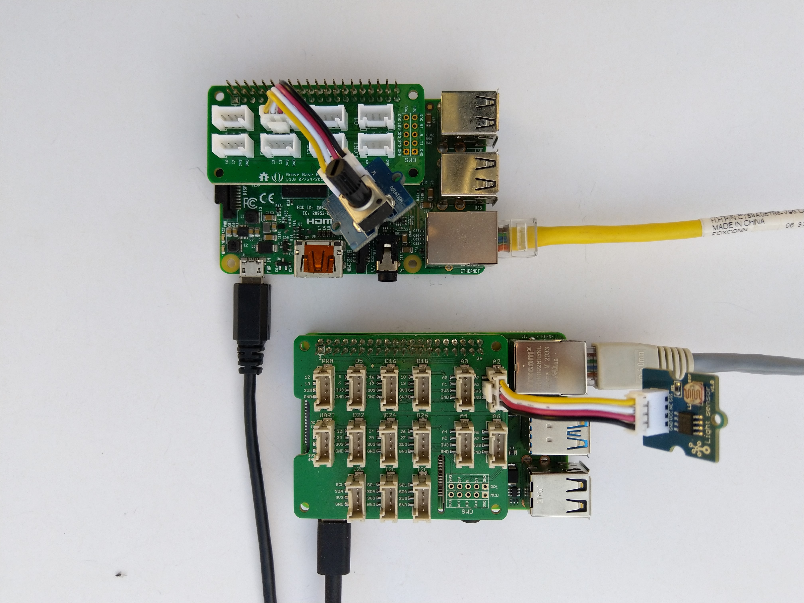

# GroveBaseHat.NetCore
A port of my [Windows 10 IoT Core library](https://github.com/KiwiBryn/GroveBaseHatWindows10IoTCore) for interfacing with the MCU on Seeestudio Grove Hats which have 6-8 Analog ports

[Seeedstudio](http://www.seeedstudio.com) Grove Base Hat for [RPI Zero](https://www.seeedstudio.com/Grove-Base-Hat-for-Raspberry-Pi-Zero.html) and [Raspberry Pi](https://www.seeedstudio.com/Grove-Base-Hat-for-Raspberry-Pi.html) to .NET Core
